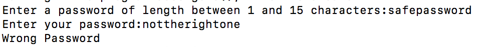
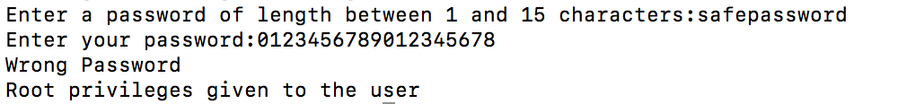
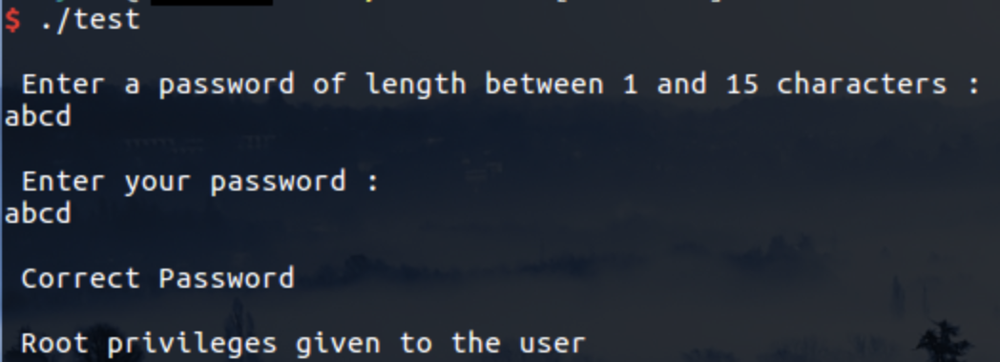
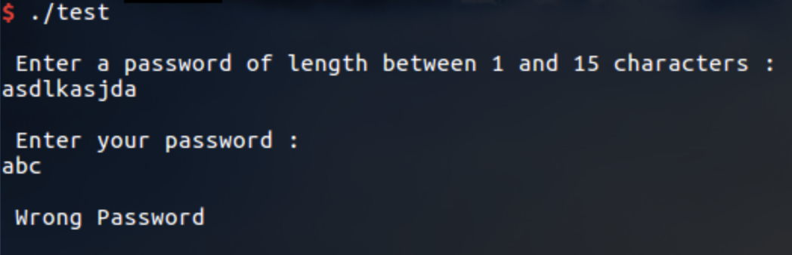
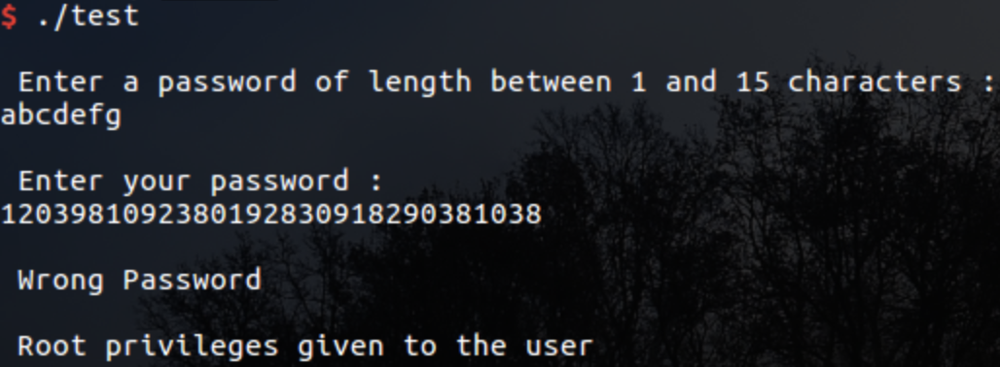

# buffer-overflow

Cyan<br>
Ryan Siu, Connie Lei, Andrew Wong<br>
Period 9<br>

## What is buffer overflow?

A __buffer overflow__ is when user input to a program, while writing data to a __buffer__, causes the unintentional overwriting of adjacent memory. This can be exploited, termed a __buffer overflow attack__.

## The Stack

The __stack__ is an example of a FIFO data structure, with two operations: _push_ (adding to the top) and _pop_ (removing from the top). In many operating systems, each program has its own stack, and each stack is used to store local variables and return addresses of functions in that program.

| __Pushing to a stack__   |  |
|--------------------------|-----------------------------------------------------------------------|
| __Popping from a stack__ |   |

For example, let's say we have the following program in C:

```c
void foo( int input ) {
    char buffer[5];
    printf("Hello!");
}

int main() {
    foo( 1 );
    return 0;
}
```

The stack would look something like this:

<table>
  <tr><td>buffer[0] buffer[1] buffer[2] ...</td></tr>
  <tr><td>argument of foo</td></tr>
  <tr><td>address of return</td></tr>
  <tr><td>stack before calling foo</td></tr>
</table>

When the function `foo` is called, the calling function's address of return (where the calling function is in memory) is pushed onto the stack. Zeroes are then pushed onto the stack for local variables--including the argument for `foo` and the characters in the `buffer` array.

## Programming Example

There are two code examples in the repository. Both of them worked on macOS High Sierra v10.13.4. 
`cbuf.c` did not work on Windows, but `test.c` did. It was not tested on Linux. In order to run the code, gcc is required. The repository also holds three text files that can be used for ease of testing. 
- correct: matching passwords within bounds to show what should happen when passwords match
- wrong: non matching passwords within bounds to show what should happen when passwords do not match
- over: non matching passwords exceeding bounds to show a buffer overflow example

To compile:
- Clone the repository. `cd` into the repository and run `make` to compile the both code examples. 
- Copy the code below. Compile with `gcc -Wall -Wextra -O0 -g -fno-stack-protector buf.c -o buf` or `gcc -Wall -Wextra -O0 -g -fno-stack-protector test.c -o test`.

To test:
- `./buf` or `./test` and try different combinations
- `./buf < over` and substiute over with the other two files
The allowed length is 15, going over causes an overflow. The program breaks and allows permission where permission was not granted.

```c
//buf.c
#include <stdio.h>
#include <string.h>

int main(void)
{
  char buff[15];
  int pass = 0;
  char tempbuff[15];
  
  printf("Enter a password of length between 1 and 15 characters:");
  gets(buff);

  printf("\nEnter your password:");
  gets(tempbuff);

  if(strcmp(tempbuff, buff))
    {
      printf ("\nWrong Password\n");
    }
  else
    {
      printf ("\nCorrect Password\n");
      pass = 1;
    }

  if(pass)
    printf ("\nRoot privileges given to the user \n");

  return 0;
}
```
```c
//test.c
#include <stdio.h>
#include <string.h>

struct app {
  char buff[15];
  char tempbuff[15];
  int pass;
};

int main(void)
{
  struct app app;
  app.pass = 0;

  printf("\n Enter a password of length between 1 and 15 characters : \n");
  gets(app.buff);
  //strcpy("%s",buff);

  printf("\n Enter your password : \n");
  gets(app.tempbuff);
  //strcpy("%s",tempbuff);

  if(strcmp(app.tempbuff, app.buff))
    {
      printf ("\n Wrong Password \n");

    }
  else
    {
      printf ("\n Correct Password \n");
      app.pass = 1;
    }

  if(app.pass)
    {
      /* Now Give root or admin rights to user*/
      printf ("\n Root privileges given to the user \n");
    }

  return 0;
}
```
over
```
safepassword
012345678901234567890
```
corrrect
```
safepass
safepass
```
wrong
```
safepass
notsafepass
```

`buf.c` on OS

| __correct__   |  |
|--------------------------|-----------------------------------------------------------------------|
|     __wrong__ |   |
|||
|      __over__ |   |

`test.c` on Windows

| __correct__   |  |
|--------------------------|-----------------------------------------------------------------------|
|     __wrong__ |   |
|||
|      __over__ |   |

## Real-life Attacks


### Examples in History


## Stack Protection


