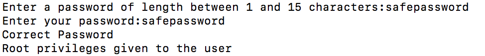

# buffer-overflow

Cyan<br>
Ryan Siu, Connie Lei, Andrew Wong<br>
Period 9<br>

## What is buffer overflow?

A __buffer overflow__ is when user input to a program, while writing data to a __buffer__, causes the unintentional overwriting of adjacent memory. This can be exploited, termed a __buffer overflow attack__.

## The Stack

The __stack__ is an example of a FIFO data structure, with two operations: _push_ (adding to the top) and _pop_ (removing from the top). In many operating systems, each program has its own stack, and each stack is used to store local variables and return addresses of functions in that program.

| __Pushing to a stack__   |  |
|--------------------------|-----------------------------------------------------------------------|
| __Popping from a stack__ |   |

For example, let's say we have the following program in C:

```c
void foo( int input ) {
    char buffer[5];
    printf("Hello!");
}

int main() {
    foo( 1 );
    return 0;
}
```

The stack would look something like this:

<table>
  <tr><td>buffer[0] buffer[1] buffer[2] ...</td></tr>
  <tr><td>argument of foo</td></tr>
  <tr><td>address of return</td></tr>
  <tr><td>stack before calling foo</td></tr>
</table>

When the function `foo` is called, the calling function's address of return (where the calling function is in memory) is pushed onto the stack. Zeroes are then pushed onto the stack for local variables--including the argument for `foo` and the characters in the `buffer` array.

## Programming Example

There are two code examples in the repository. Both of them worked on macOS High Sierra v10.13.4. 
`cbuf.c` did not work on Windows, but `test.c` did. It was not tested on Linux. In order to run the code, gcc is required. The repository also holds three text files that can be used for ease of testing. 
- correct: matching passwords within bounds to show what should happen when passwords match
- wrong: non matching passwords within bounds to show what should happen when passwords do not match
- over: non matching passwords exceeding bounds to show a buffer overflow example

To compile:
- Clone the repository. `cd` into the repository and run `make` to compile the both code examples. 
- Copy the code below. Compile with `gcc -Wall -Wextra -O0 -g -fno-stack-protector buf.c -o buf` or `gcc -Wall -Wextra -O0 -g -fno-stack-protector test.c -o test`.

To test:
- `./buf` or `./test` and try different combinations
- `./buf < over` and substiute over with the other two files
The allowed length is 15, going over causes an overflow. The program breaks and allows permission where permission was not granted.

```c
//buf.c
#include <stdio.h>
#include <string.h>

int main(void)
{
  char buff[15];
  int pass = 0;
  char tempbuff[15];
  
  printf("Enter a password of length between 1 and 15 characters:");
  gets(buff);

  printf("\nEnter your password:");
  gets(tempbuff);

  if(strcmp(tempbuff, buff))
    {
      printf ("\nWrong Password\n");
    }
  else
    {
      printf ("\nCorrect Password\n");
      pass = 1;
    }

  if(pass)
    printf ("\nRoot privileges given to the user \n");

  return 0;
}
```
```c
//test.c
#include <stdio.h>
#include <string.h>

struct app {
  char buff[15];
  char tempbuff[15];
  int pass;
};

int main(void)
{
  struct app app;
  app.pass = 0;

  printf("\n Enter a password of length between 1 and 15 characters : \n");
  gets(app.buff);
  //strcpy("%s",buff);

  printf("\n Enter your password : \n");
  gets(app.tempbuff);
  //strcpy("%s",tempbuff);

  if(strcmp(app.tempbuff, app.buff))
    {
      printf ("\n Wrong Password \n");

    }
  else
    {
      printf ("\n Correct Password \n");
      app.pass = 1;
    }

  if(app.pass)
    {
      /* Now Give root or admin rights to user*/
      printf ("\n Root privileges given to the user \n");
    }

  return 0;
}
```
over
```
safepassword
012345678901234567890
```
corrrect
```
safepass
safepass
```
wrong
```
safepass
notsafepass
```

`buf.c` on OS

| __correct__   |  |
|--------------------------|-----------------------------------------------------------------------|
|     __wrong__ |   |
|      __over__ |   |

`test.c` on Windows

| __correct__   |  |
|--------------------------|-----------------------------------------------------------------------|
|     __wrong__ |   |
|      __over__ |   |

## Real-life Attacks


### Examples in History

#### Morris Worm
The Morris worm, released from MIT on November 2, 1988, was one of the first computer worms. It was originally meant to gauge the size of the Internet rather than cause damage to computers, but a mistake in the code caused it to replicate itself excessively, resulting in computers crashing from being overloaded with processes. It exploited buffer overflow vulnerabilities in the Unix `finger` and `sendmail` protocols, allowing it to infect other computers running the Unix operating system.

Following this incident, public attitudes towards computer security began to change. Password security also improved, as the worm utilized a simple dictionary of common words to guess passwords.

#### Code Red

Code Red was a malicious worm that targeted a buffer overflow vulnerability in Microsoft's Internet Info Services (IIS) web servers, infecting over 359,000 computers throughout July 2001. It ran entirely in memory, executing code from a GET request. Here is an example of the code used to spread it across networks:

`
GET /default.ida?NNNNNNNNNNNNNNNNNNNNNNNNNNNNNNNNNNNNNNNNNNNNNNNNNNNNNNN 
NNNNNNNNNNNNNNNNNNNNNNNNNNNNNNNNNNNNNNNNNNNNNNNNNNNNNNNNNNNNNNNNNNNNNNN 
NNNNNNNNNNNNNNNNNNNNNNNNNNNNNNNNNNNNNNNNNNNNNNNNNNNNNNNNNNNNNNNNNNNNNNN 
NNNNNNNNNNNNNNNNNNNNNNNNNNN%u9090%u6858%ucbd3%u7801%u9090%u6858%ucb 
d3%u7801%u9090%u6858%ucbd3%u7801%u9090%u9090%u8190%u00c3%u0003%u
8b00%u531b%u53ff%u0078%u0000%u00=a 
`

It affected Windows NT and 2000 users and attempted to launch a DDoS attack against the White House's web servers. Depending on the day of the month, it would either try to propagate itself, send junk data to `www.whitehouse.gov`, or do nothing. 

Microsoft released a patch that fixed the buffer overflow weakness in the IIS server a few days after the worm was discovered.

#### Blaster Worm

The Blaster worm attacked hundreds of thousands of Windows XP and 2000 users during August 2003, using a buffer overflow exploit in the Windows remote procedure call (RPC) interface. It spread through TCP port 135, easily infecting users without firewalls.

Similarly to the Morris worm, it overloaded computers, causing them to crash. Firewalls became integrated into newer operating systems as a result of this attack, as Windows XP users previously had to install third-party firewall software to block unwanted connections.

#### Heartbleed

Heartbleed is a more recent example of vulnerabilities in open-source libraries. It is a weakness in OpenSSL, a widely-used encryption library, specifically its `heartbeat` request. This oversight, discovered in 2014, resulted in over 500,000 websites being compromised.

The `heartbeat` request checks if two computers are still connected by exchanging a small packet of encrypted data between the two. The problem lies in one line of code:

`memcpy(bp, pl, payload);`

`bp` is where the data will be copied to

`pl` is where the data is copied from

`payload` is the length of the data that will be copied

`memcpy` does not check whether the length of the data copied matches `payload`, so a malicious user could potentially receive sensitive data (e.g. passwords, private keys, cookies) by exploiting the command.

Heartbleed is more of a reverse buffer overflow, known as a buffer overread, since it outputs data from adjacent memory, rather than taking an input that bleeds into adjacent memory.

## Countermeasures

Some methods to protect against buffer overflow are address space layout randomization (ASLR), data execution prevention (DEP), and bounds checking.

ASLR randomizes where executable programs are loaded into memory, making it harder for attacks to reliably reach adjacent memory where code can be executed.

DEP flags certain parts of memory as "non-executable", meaning that exceptions are raised when there is an attempt to run code in these areas.

Bounds checking ensures that the data is sanitized and does not exceed a certain length, preventing any code from being injected into adjacent memory and executed.
